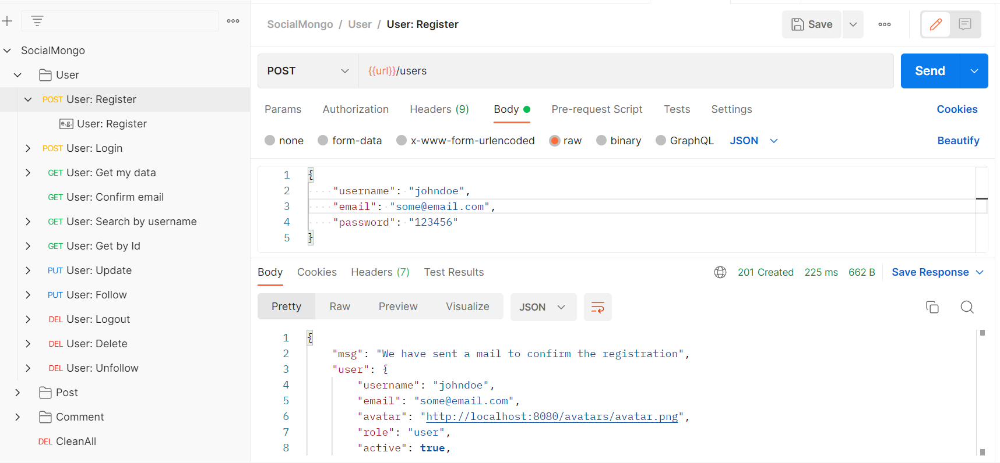
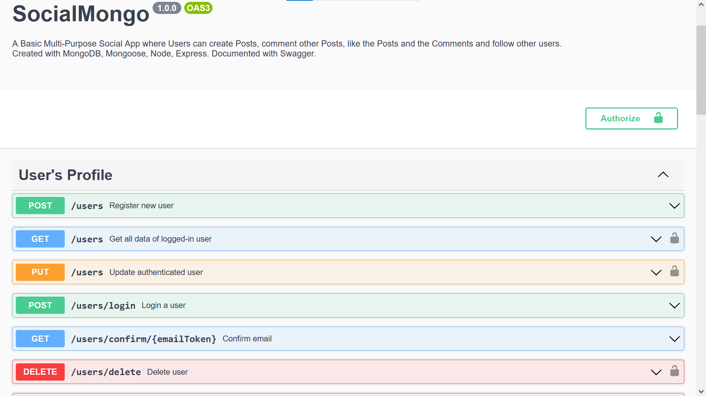

# SocialMongo

Exercise for [The Bridge](https://thebridge.tech).

https://classroom.google.com/u/0/c/NDgwNDYwMTI2OTAz/a/NTMxNTc5MDgwMjgw/details

> * Build an API for a social network with users, posts and comments.
> * Users can create/update/delete posts
> * Users can comment posts
> * Users can like/unlike posts and comments
> * Users can follow/unfollow other users
> * Users can see posts and comments
> * Users can see the public data of other users
> * Users can delete their account and all the included data

### Author

[Xavimat @xavi-mat](@xavi-mat) [LinkedIn](https://www.linkedin.com/in/xavier-matoses/)

### Technologies and dependencies
* JavaScript
* Nodejs
* express
* MongoDB
* Mongoose
* multer
* bcryptjs
* jsonwebtoken
* nodemailer
* Atlas

### Repository
You can fork or clone the code from:
```
https://github.com/xavi-mat/boot511-back-social
```

### Screenshots
* From Postman



* From Swagger



### Usage
There are three main blocks of endpoints: `/users`, `/posts`, and `/comments`.

|method|endpoint|role|use|
|------|--------|----|---|
| |USERS| | |
|POST|`/users`|anyone|Register a new user|
|POST|`/users/login`|anyone|Login with credentials|
|GET|`/users`|user|Get own user's data|
|GET|`/users/confirm/:emailToken`|anyone|Confirm email|
|GET|`/users/search`|anyone|Search by username|
|GET|`/users/id/:_id`|user|Get user data by Id|
|PUT|`/users`|user|Update own information|
|PUT|`/users/follow/:_id`|user|Follow user by Id|
|DELETE|`/users/`|user|Delete all User's data|
|DELETE|`/users/logout`|user|Logout|
|DELETE|`/users/follow/:_id`|user|Stop following user by Id|
| |POSTS| | |
|POST|`/posts`|user|Create a post|
|GET|`/posts/id/:_id`|anyone|Get a post by Id|
|GET|`/posts/search`|anyone|Search a post by title|
|GET|`/posts`|anyone|Get all posts|
|PUT|`/posts/like/id/:_id`|user|Like a post by Id|
|PUT|`/posts/id/:_id`|author|Update own posts by Id|
|DELETE|`/posts/id/:_id`|author|Delete own post by Id|
|DELETE|`/posts/like/id/:_id`|user|Stop liking a post by Id|
| |COMMENTS| | |
|POST|`/comments`|user|Create a comment to a post|
|GET|`/comments/id/:_id`|anyone|Get a comment by Id|
|PUT|`/comments/id/:_id`|author|Update own comment by Id|
|PUT|`/comments/like/:_id`|user|Like a comment by Id|
|DELETE|`/comments/id/:_id`|author|Delete own comment by Id|
|DELETE|`/comments/like/:_id`|user|Stop liking a comment by Id|
| |SEEDERS| | |
|DELETE|`/users/clean-all`|admin|Empty database and seed it randomly|
| |DOCUMENTATION| | |
|GET|`/api-docs`|anyone|Swagger documentation and testing|

See detailed examples of requests and responses in:

https://documenter.getpostman.com/view/11287519/Uz5FLcd7

See also Swagger documentation and testing in endpoint `/api-docs`

### Acknoledgements
* [Sofía](https://github.com/SofiaPinilla), [Ger](https://github.com/GeerDev) and [Ivan](https://github.com/ivanpuebla10), our team of teachers.
* All the classmates at the bootcamp.
* Pigwidgeon, the owl.